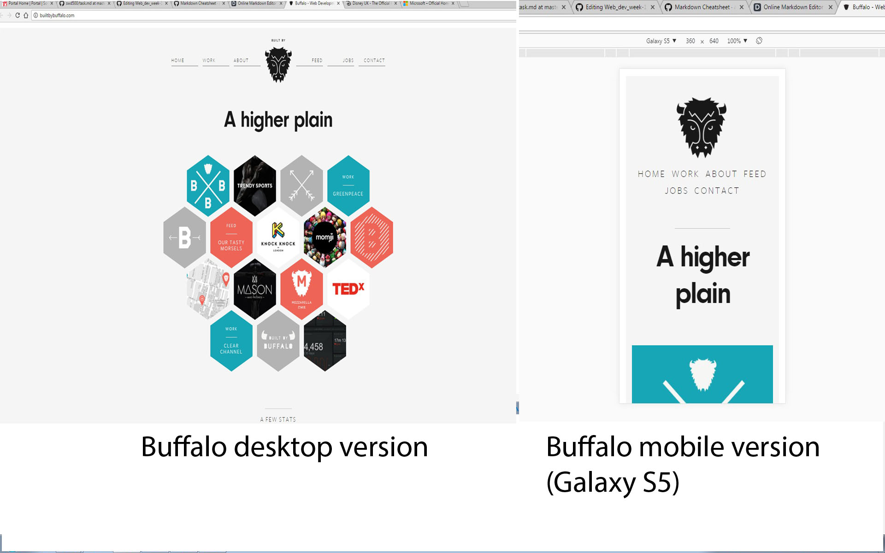

# Web_dev_week-1_Practical
Comparing the mobile and desktop version of the website Buffalo

Buffalo Webiste **this is a sting comment**


[Buffalo Website](http://builtbybuffalo.com/)
>> I'm a note

```html

<html>

<h1> Comparison of Desktop Vs Mobile </h1>

```

## This is how to include an image
 '
>> <sub> this is the website buffalo, from the desktop version (Left) and mobile version (Right) </sub>

1. Desktop
⋅⋅* Takes up more of the screen. 

